# PRÉSENTATION DE DOCKER

Dans ce README, nous allons apprendre à installer et utiliser la technologie Docker pour créer un environnement de développement à l'aide d'images et de docker file et exporter ses projets.

<p align="center">
  
</p>

# PRÉREQUIS

Pour ce tutoriel, vous devez être soit sur Windows ou sur une distribution Linux (pas de MacOS malheureusement).
Il faut faudra également un bon terminal : sur Linux pas de soucis, en revanche sur Windows vous pouvez utiliser [Cmder](https://cmder.net/) qui est un super émulateur de terminal.

<p align="center">
  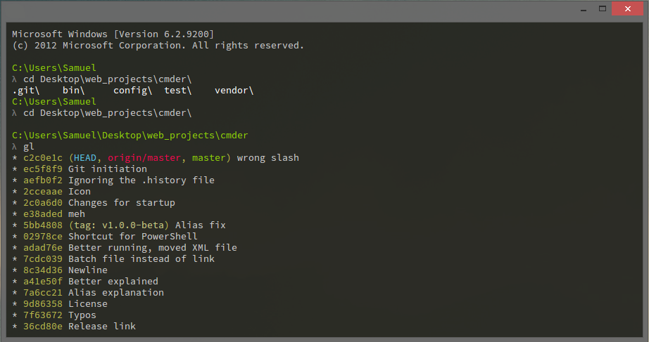
</p>

Docker est une technologie qui se base sur LXC : Linux Container, il est donc recommandé d'avoir quelques notions élémentaires en Linux et en commande bash. Voici un super 
<a href="https://openclassrooms.com/fr/courses/43538-reprenez-le-controle-a-laide-de-linux" target="_blank">
  tutoriel
</a>  pour apprendre rapidement les bases de Linux.


# INSTALLATION 

## LINUX

Commencez par vous rendre dans votre terminal et tapez ces lignes de commandes :

1. Mettre à jour les apt packages

```bash
sudo apt-get update
```

2. Installer docker

```bash
sudo apt install docker.io
```

3. (OPTIONNEL) Lancer Docker au démarrage

```bash
sudo systemctl start docker
```

```bash
sudo systemctl enable docker
```

4. Vous pouvez maintenant utiliser les commandes Docker dans votre terminal

## WINDOWS

Vous avez le choix entre deux méthodes d'utilisation :

* Soit vous préférez un peu d'interfaces graphiques et vous utilisez Docker Desktop

* Soit vous préférez absolument tout faire dans le terminal et vous utilisez Boot2Docker

### 1. DOCKER DESKTOP

1. Installez  afin de pouvoir se connecter facilement et télécharger des images et des docker files sur le Hub de Docker.

<p align="center">
  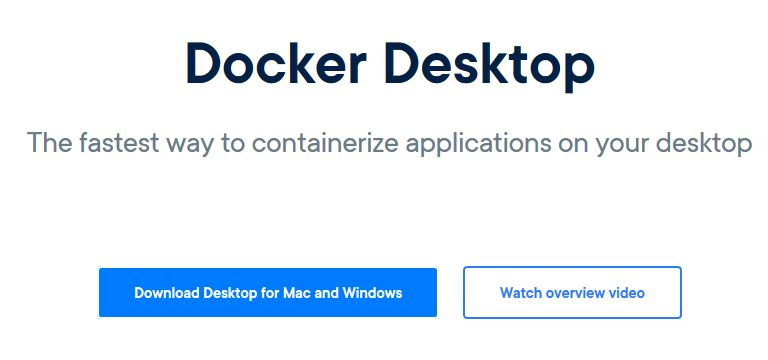
</p>

2. Lancer Docker Desktop et lancez Cmder, vous pouvez maintenant utiliser les lignes de commande de Docker

<p align="center">
  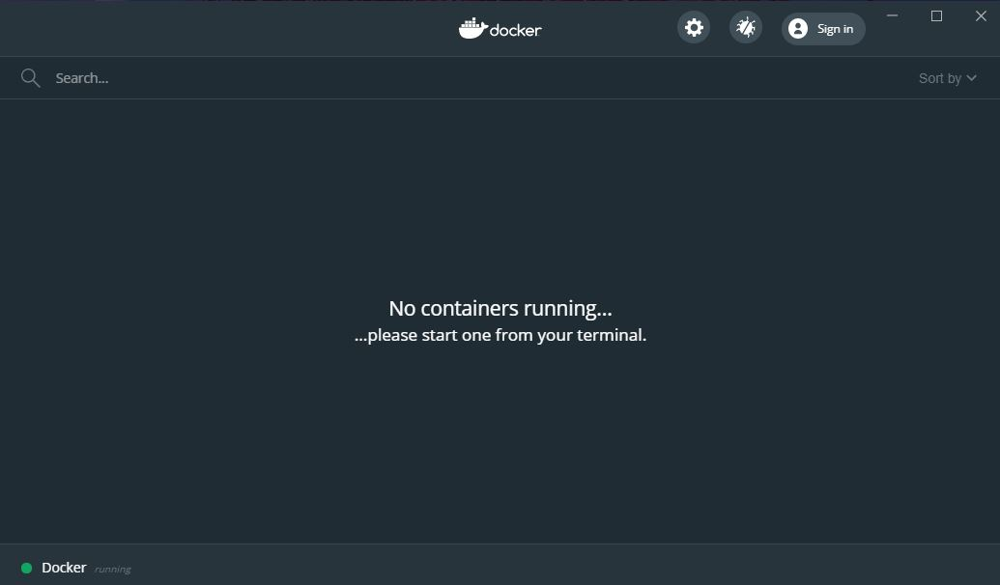
</p>

### 2. Boot2Docker
 
 1. Installez simplement [Boot2Docker](https://www.ibm.com/developerworks/community/blogs/jfp/entry/running_ipython_notebooks_in_a_docker_container_on_windows?lang=en), l'installation est très bien expliqué sur ce site. 
 
 2. Lancez Cmder et tapez :
 
 ```bash
 Boot2Docker ssh
 ```
 <p align="center">
  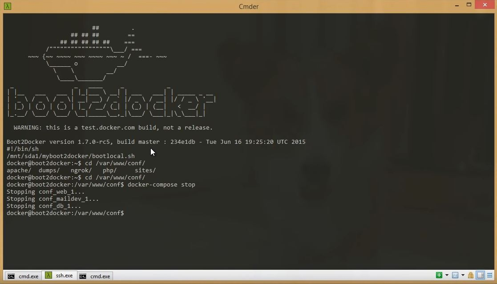
</p>
 
Vous pouvez maintenant utiliser les lignes de commande de Docker

## UTILISATION

Une fois que vous êtes dans votre terminal et que tout a bien été installé comme expliqué précédemment, vous pouvez tapez toutes les lignes de commandes ci-dessous :

* Regarder les container en éxécution

 ```bash
 docker ps
 ```
<p align="center">
  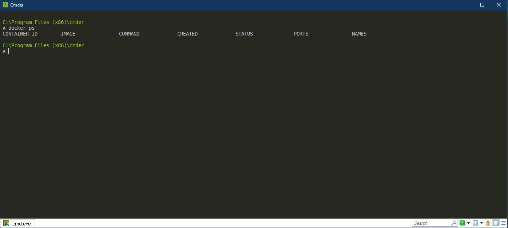
</p>
 
* Lancer une image Debian dans le terminal. Si vous ne l'avez pas (ce qui est le cas lors de la première éxécution de cette ligne de commande), Docker va automatiquement télécharger l'image de Debian sur Docker Hub.

 ```bash
 docker run -ti debian
 ```
 
 <p align="center">
  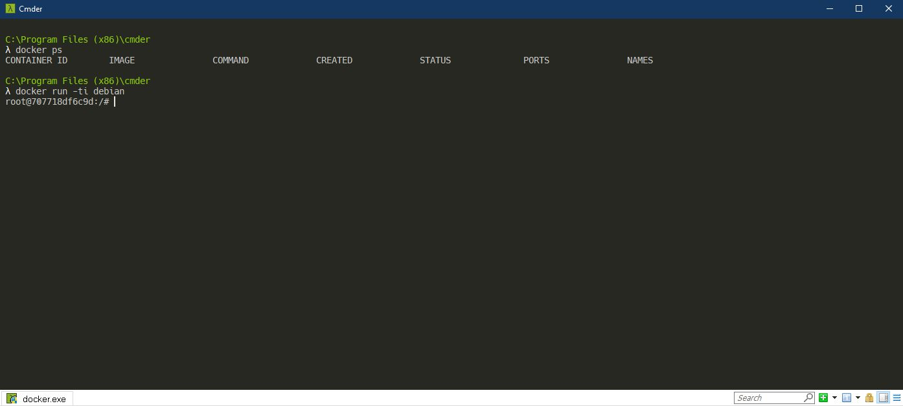
</p>
 
 * Un conteneur avec l'image Debian officiel de Docker Hub va se créer et vous trouvez maintenant dans le conteneur. Nous allons créer un fichier test.txt pour essayer.
 
 ```bash
 ls
 ```
 
 ```bash
 touch test.txt
 ```
 
 ```bash
 ls
 ```
 
 <p align="center">
  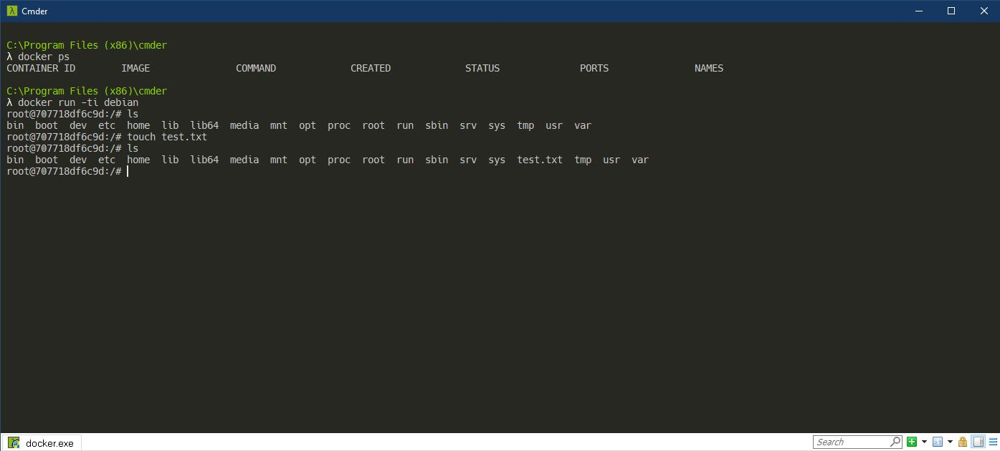
</p>

* Ouvrez un autre terminal dans Cmder (lancer Boot2Docker ssh si nécessaire), vous allez voir toutes les images que vous avez téléchargé 

```bash
 docker images
 ```
 
 ```bash
 docker ps
 ```

<p align="center">
  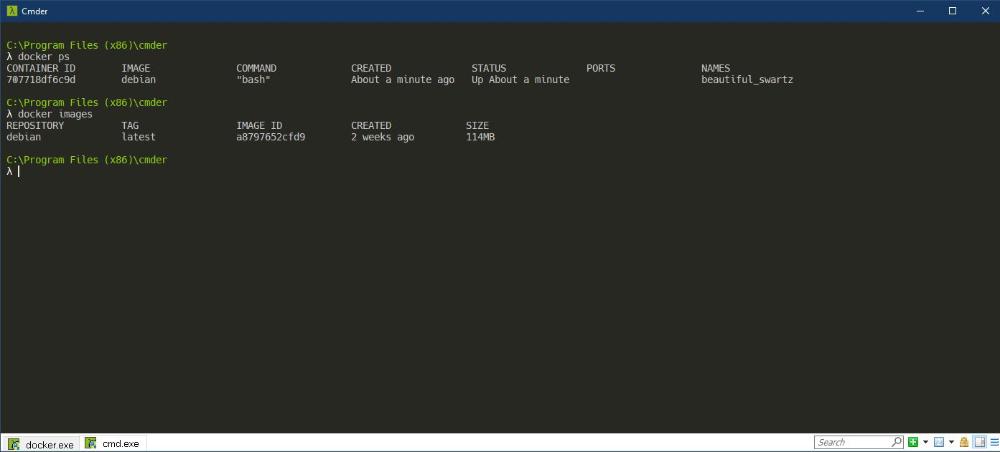
</p>

* Les modifications faites à l'image de Debian n'ont toujours pas été enregistré, nous allons les sauvegarder dans une nouvelle image pour garder l'image Debian comme template pour de futurs projets (xxx représente les 3 premiers chiffres de l'image id renvoyé par votre terminal). 

```bash
docker diff xxx
```

```
docker commit xxx debiantest
```

```
docker images
```

<p align="center">
  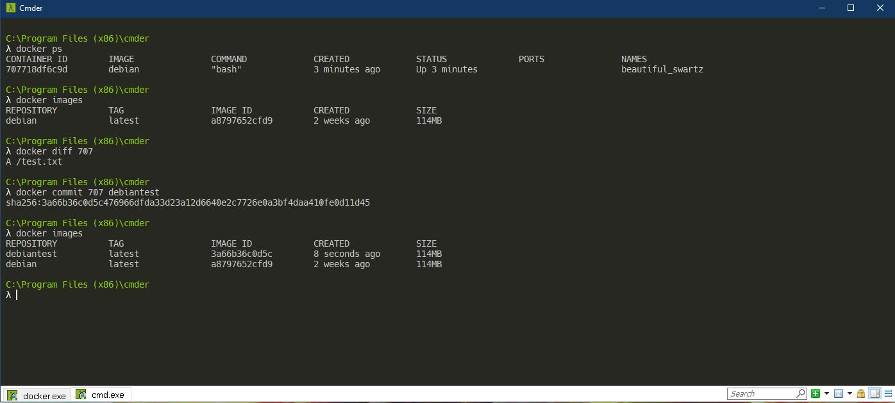
</p>

* Nous pouvons maintenant exporter notre image pour que d'autres personnes puissent la télécharger et l'utiliser

```
docker save debiantest > debiantest.zip
```

<p align="center">
  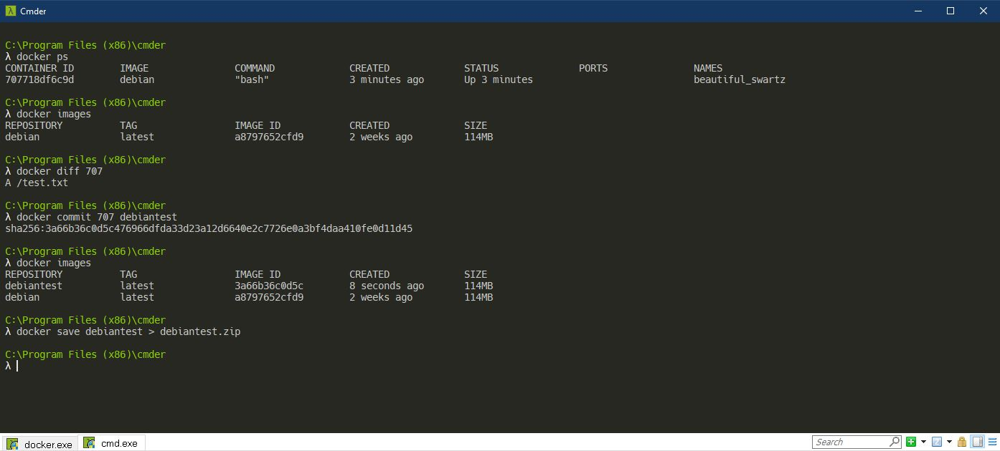
</p>

<p align="center">
  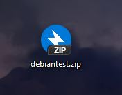
</p>
