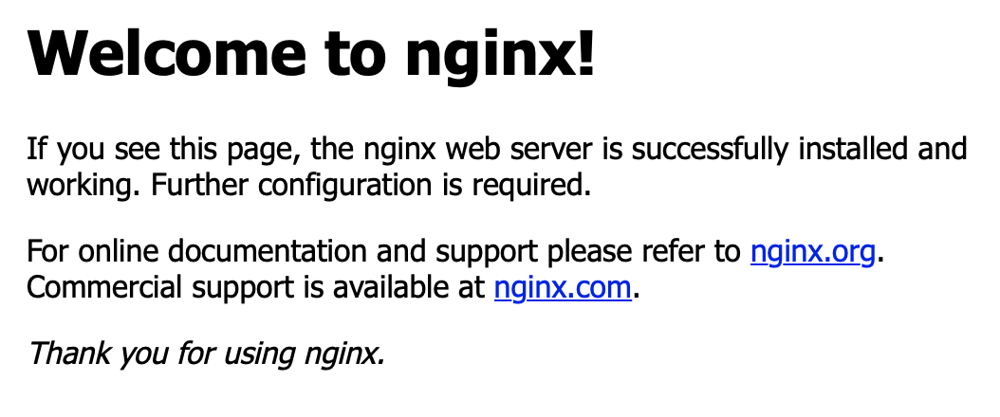
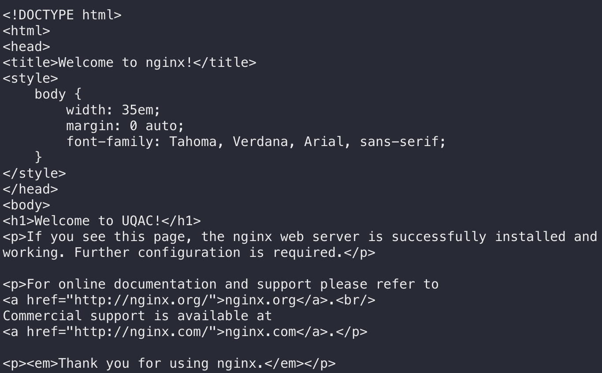
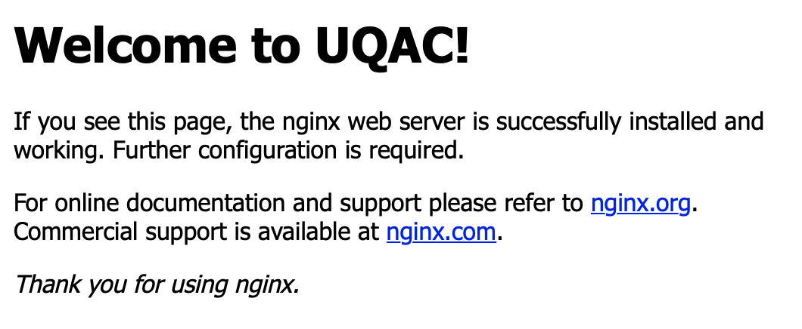

# PRÉSENTATION DE DOCKER


Docker est la plateforme de containers la plus utilisée et la plus populaire. Elle permet de lancer des applications dans des conteneurs logiciels, elle offre un haut degré de portabilité.
La différence avec une machine virtuelle est que Docker permet de développer des applications de façon plus efficiente, en utilisant moins de ressources, et de déployer ces applications plus rapidement.


<p align="center">
  
</p>

Dans ce README, nous allons apprendre à installer et utiliser la technologie Docker pour créer un environnement de développement à l'aide d'images et de docker file et exporter ses projets.

# PRÉREQUIS

Pour ce tutoriel, vous devez être soit sur Window, une distribution Linux ou bien MacOS.
Il faut faudra également un bon terminal : sur Linux et MacOS pas de soucis, en revanche sur Windows vous pouvez utiliser [Cmder](https://cmder.net/) qui est un super émulateur de terminal.

<p align="center">
  
</p>

Docker est une technologie qui se base sur LXC : Linux Container, il est donc recommandé d'avoir quelques notions élémentaires en Linux et en commande bash. Voici un super 
<a href="https://openclassrooms.com/fr/courses/43538-reprenez-le-controle-a-laide-de-linux" target="_blank">
  tutoriel
</a>  pour apprendre rapidement les bases de Linux.


# INSTALLATION 

## LINUX

Commencez par vous rendre dans votre terminal et tapez ces lignes de commandes :

1. Mettre à jour les apt packages

```bash
sudo apt-get update
```

2. Installer docker

```bash
sudo apt install docker.io
```

3. (OPTIONNEL) Lancer Docker au démarrage

```bash
sudo systemctl start docker
```

```bash
sudo systemctl enable docker
```

4. Vous pouvez maintenant utiliser les commandes Docker dans votre terminal.

## WINDOWS 

Vous avez le choix entre deux méthodes d'utilisation :

* Soit vous préférez un peu d'interfaces graphiques et vous utilisez Docker Desktop

* Soit vous préférez absolument tout faire dans le terminal et vous utilisez Boot2Docker

### 1. DOCKER DESKTOP

1. Installez  afin de pouvoir se connecter facilement et télécharger des images et des docker files sur le Hub de Docker.

<p align="center">
  
</p>

2. Lancer Docker Desktop et lancez Cmder, vous pouvez maintenant utiliser les lignes de commande de Docker.

<p align="center">
  
</p>

### 2. Boot2Docker
 
 1. Installez simplement [Boot2Docker](https://www.ibm.com/developerworks/community/blogs/jfp/entry/running_ipython_notebooks_in_a_docker_container_on_windows?lang=en), l'installation est très bien expliqué sur ce site. 
 
 2. Lancez Cmder et tapez :
 
 ```bash
 Boot2Docker ssh
 ```
 <p align="center">
  
</p>
 
Vous pouvez maintenant utiliser les lignes de commande de Docker.

## MACOS

Pour MacOs il faut utiliser Docker Desktop, l'installation est la même que sur Windows. Une fois le logiciel démarré les commandes sont également les mêmes que dans la suite du tutoriel.

## UTILISATION

Une fois que vous êtes dans votre terminal et que tout a bien été installé comme expliqué précédemment, vous pouvez tapez toutes les lignes de commandes ci-dessous :

* Regarder les container en éxécution

 ```bash
 docker ps
 ```
<p align="center">
  
</p>
 
* Lancer une image Debian dans le terminal. Si vous ne l'avez pas (ce qui est le cas lors de la première éxécution de cette ligne de commande), Docker va automatiquement télécharger l'image de Debian sur Docker Hub.

 ```bash
 docker run -ti debian
 ```
 
 L'option "-ti" permet d'obtenir un accès shell sur le conteneur.
 
 <p align="center">
  
</p>
 
 ### Quelques commandes utiles :
 
 * Arrêter un conteneur 
 
 ```bash
 docker stop <container-id/container-name>
 ```
 
 * Relancer un conteneur 
 
 ```bash
 docker restart <container-id/container-name>
 ```
 
 * Supprimer un conteneur 
 
 ```bash
 docker rm <container-id/container-name>
 ```
 
 * Obtenir un accès shell sur un conteneur
 
 ```bash
 docker exec –it <container-id|container-name> /bin/bash
 ```
 
 <br>
 <br>
 
 Un conteneur avec l'image Debian officiel de Docker Hub est mainteant créé et vous avez un accès à un shell dans le conteneur
 * Vous pouvez créer un fichier test.txt pour essayer.
 
 ```bash
 ls
 ```
 
 ```bash
 touch test.txt
 ```
 
 ```bash
 ls
 ```
 
 <p align="center">
  
</p>

* Quittez le shell du conteneur avec "exit" ou ouvrez un autre terminal dans Cmder (lancer Boot2Docker ssh si nécessaire), vous allez voir toutes les images que vous avez téléchargé.

 ```bash
 docker images
 ```
 
<p align="center">
  
</p>

* Les modifications faites à l'image de Debian n'ont toujours pas été enregistré, nous allons les sauvegarder dans une nouvelle image pour garder l'image Debian comme template pour de futurs projets (xxx représente les 3 premiers chiffres de l'image id renvoyé par votre terminal). 

```bash
docker diff xxx
```

```
docker commit xxx debiantest
```

```
docker images
```

<p align="center">
  
</p>

* Nous pouvons maintenant exporter notre image pour que d'autres personnes puissent la télécharger et l'utiliser.

```
docker save debiantest > debiantest.zip
```

<p align="center">
  
</p>

<p align="center">
  
</p>

## EXPORT

Vous pouvez retrouvez l'image générée dans ce tutoriel dans ce repository, vous pouvez le télécharger le dezipper, le run et le modifier à votre tour.

```
docker run -ti debiantest
```

C'est donc de cette manière que vous pourrez rapidement déployer et exporter ou télécharger et utiliser des applications nécessitant un environnement particulier.

## DOCKER VOLUME 

Il est important de parler ici de Docker Volume en effet les conteneurs ont à l’origine été pensés comme un moyen de déployer à grande échelle des microservices, et donc pour l’essentiel, des applications sans état ne nécessitant pas de persistance de leur stockage. Dans la pratique, cela signifie que par défaut, à l’arrêt d’un conteneur, l’espace qu’il occupait et les données générées à l’intérieur du conteneur sont effacés. Docker a donc prévu plusieurs technologies pour gérer des volumes persistants.

### Quelques commandes utiles :
 
 * Créer un volume
 
 ```bash
 docker volume create <volume-name>
 ```
 
 * Lister les volumes
 
 ```bash
 docker volume ls
 ```
 
 * Supprimer un volume
 
 ```bash
 docker volume rm <volume-name>
 ```
 
 <br>
 <br>
 
 On va découvrir ici à travers un petit tutoriel comment utiliser docker volume.
 
 * On commence par créer un volume
 
 ```bash
 docker volume create mon volume
 ```
 
  * Nous allons créer un conteneur nginx avec le volume persistant 
 ```bash
 docker run -tid -p 8080:80 --mount source=monvolume,target=/usr/share/nginx/html nginx
 ```
 Lorsqu'on va sur la page localhost:8080 
 <p align="center">
  
 </p>

 * Nous allons modifier le fichier /var/lib/docker/volumes/monvolume/_data/index.html dans le volume. On change "Welcome to nginx!" par "Welcome to UQAC!"

 <p align="center">
  
 </p>
 
 * Maintenant quand on rafraichit la page localhost:8080
 <p align="center">
  
  
 </p>

 Si on supprime maintenant ce conteneur on ne perd pas les données, on peut aussi créer un autre conteneur avec ces données.
